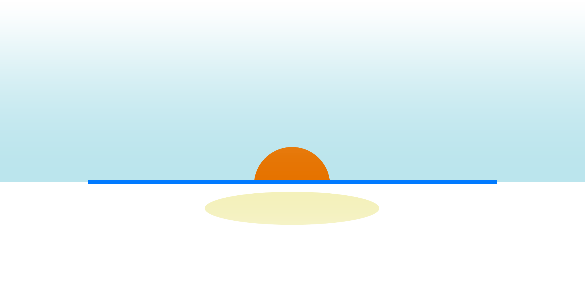
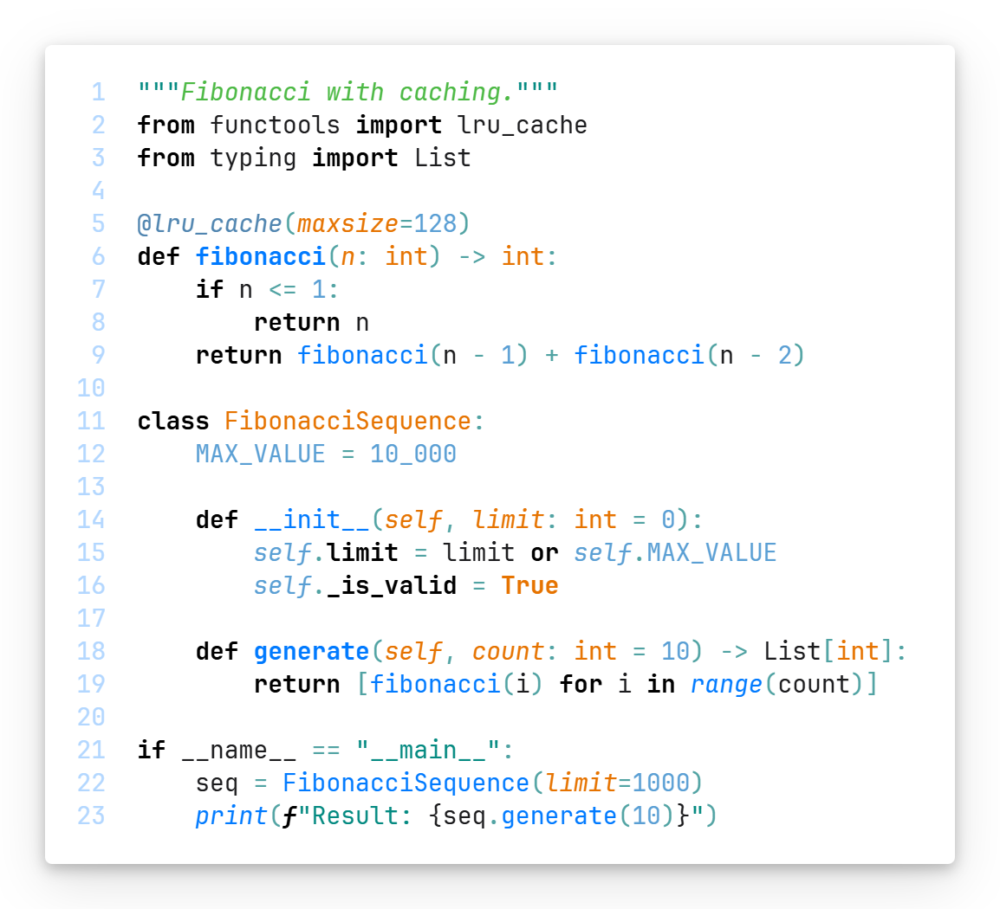
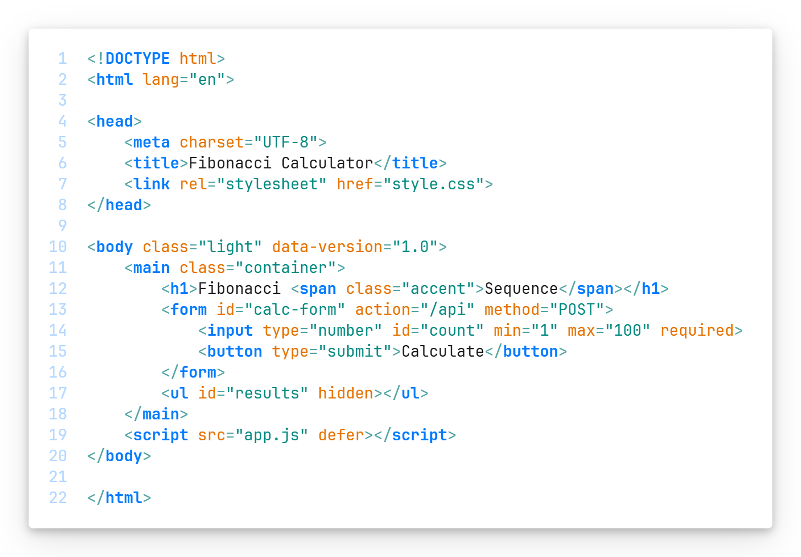
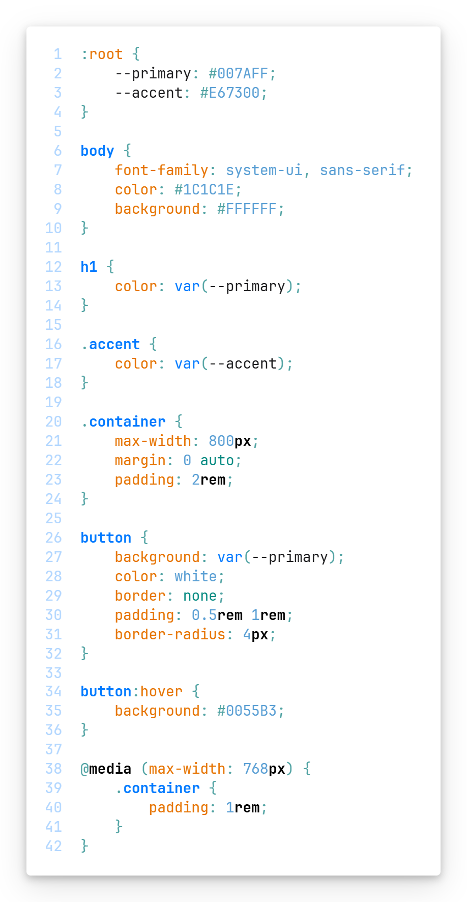
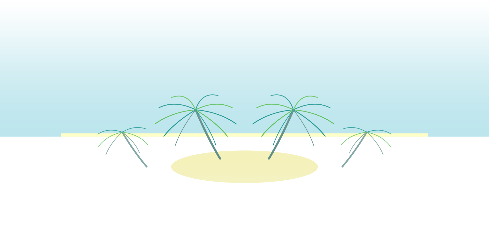

# Sunline

_A clean, minimal light theme where the blue sky meets the warm sun._



## Features

- **Azure blue** as the primary color for navigation and actions
- **Warm orange** accents for highlights, warnings, and focal points
- **Tropical teal & green** for strings and comments
- Clean white backgrounds with subtle blue tints
- Carefully balanced contrast for comfortable long coding sessions
- Semantic token coloring for modern language support
- Complete UI theming including merge editor and notebooks

## Color Palette

### Syntax Colors

| Color                                                             | Hex       | Usage                                   |
| ----------------------------------------------------------------- | --------- | --------------------------------------- |
|  **Black bold**                  | `#000000` | Keywords, control flow, declarations    |
|  **Blue bold**                     | `#007AFF` | Functions, methods, modules, exceptions |
|  **Denim blue**        | `#5085B0` | Decorators, regex                       |
|  **Light blue italic** | `#5A9FD4` | Instance references, numbers, constants |
|  **Orange bold**               | `#E67300` | Classes, types, language constants      |
|  **Orange italic**             | `#E67300` | Parameters                              |
|  **Teal**                          | `#048A81` | Strings                                 |
|  **Green italic**    | `#4CB944` | Docstrings                              |
|  **Teal gray italic**    | `#5A8A85` | Comments                                |
|  **Teal blue**           | `#51A3A3` | Operators, punctuation                  |

### UI Colors

| Color                                                            | Hex       | Usage                                    |
| ---------------------------------------------------------------- | --------- | ---------------------------------------- |
|  **Blue**                         | `#007AFF` | Active borders, icons, links, selections |
|  **Light blue** | `#66B3FF` | Inactive icons, secondary elements       |
|  **Pale blue**          | `#E3ECFF` | Hover backgrounds, highlights            |
|  **Orange**                   | `#E67300` | Warnings, modified files, badges, cursor |
|  **Red**                            | `#D93526` | Errors                                   |
|  **Green**                      | `#32A852` | Success, Git additions                   |

### Merge Editor

| Color      | Usage                         |
| ---------- | ----------------------------- |
| **Blue**   | Current changes (your code)   |
| **Orange** | Incoming changes (their code) |
| **Gray**   | Common ancestor               |

## Screenshots

### Python



### JavaScript


### HTML & CSS




## Installation

1. Open **Extensions** in VS Code (`Ctrl + Shift + X`)
2. Search for _`Sunline`_
3. Click **Install**
4. Open **Command Palette** (`Ctrl + Shift + P`)
5. Select `Preferences: Color Theme` → `Sunline`

## Recommended Settings

For the best experience, consider these VS Code settings:

```json
{
    "editor.fontFamily": "JetBrains Mono, Fira Code, monospace",
    "editor.fontLigatures": true,
    "editor.bracketPairColorization.enabled": true,
    "editor.guides.bracketPairs": true
}
```

[MIT](LICENSE)

**Sunline: Where code meets the sunrise!** 🌅


