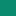
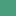
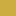
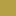
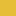
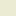
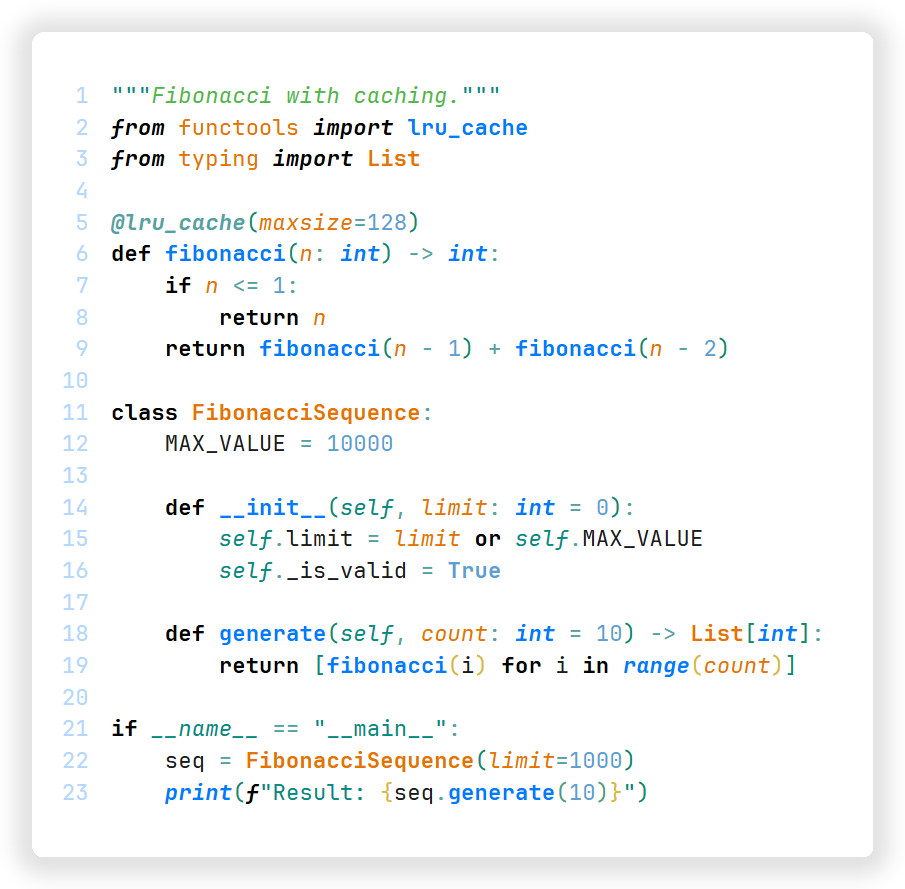
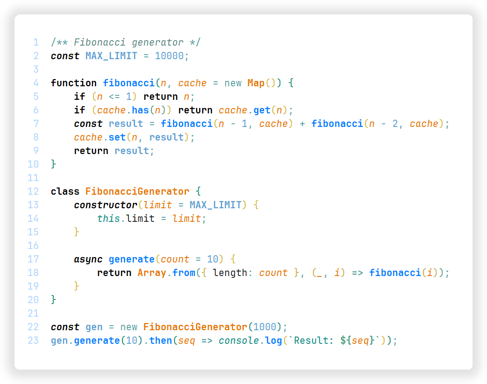
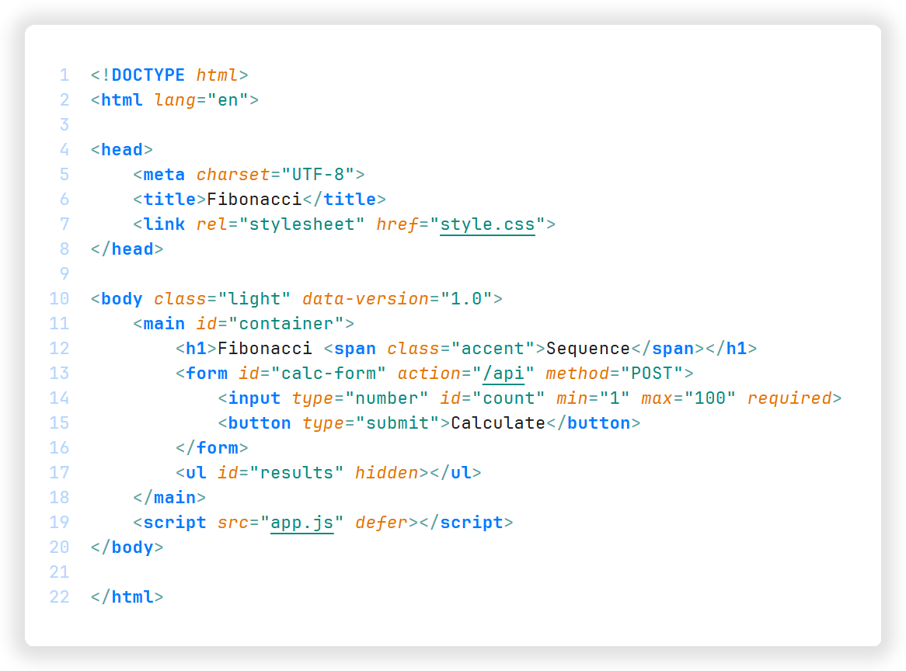
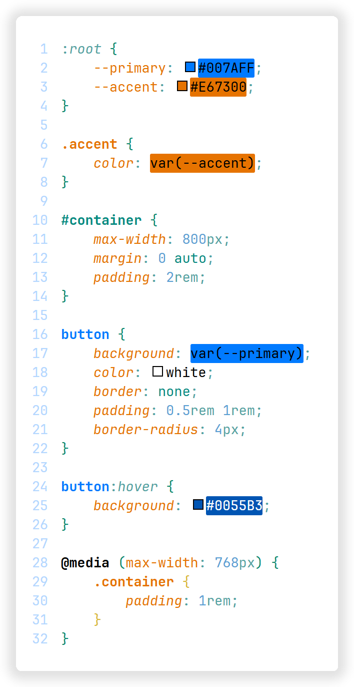

# Sunline

_A clean, minimal light theme where the blue sky meets the warm sun._


## Features

- **Azure blue** as the primary color for navigation and actions
- **Warm orange** accents for highlights, warnings, and focal points
- **Tropical teal & green** for strings and comments
- **Golden sand** tones for bracket pairs and search highlights
- Clean white backgrounds with subtle blue tints
- Carefully balanced contrast for comfortable long coding sessions
- Semantic token coloring for modern language support
- Complete UI theming including merge editor and notebooks

## Color Palette

### Syntax Colors

| Color                                                          | Hex       | Usage                                         |
| -------------------------------------------------------------- | --------- | --------------------------------------------- |
|  **Black bold**               | `#000000` | Keywords, control flow, declarations          |
|  **Blue bold**                  | `#007AFF` | Functions, methods, exceptions                |
|  **Blue italic**                | `#007AFF` | Built-in functions (`print`, `range`)         |
|  **Light blue**     | `#5A9FD4` | Numbers, constants, `True`/`False`/`None`     |
|  **Orange bold**            | `#E67300` | Classes, types, CSS variables                 |
|  **Orange italic**          | `#E67300` | Parameters                                    |
|  **Teal**                       | `#048A81` | Strings, `self`/`this`, object keys           |
|  **Teal italic**                | `#048A81` | Built-in variables (`__name__`, `console`)    |
|  **Teal blue**        | `#51A3A3` | Operators, punctuation, decorators, CSS units |
|  **Teal gray italic** | `#5A8A85` | Comments                                      |
|  **Green italic** | `#4CB944` | Docstrings                                    |

### UI Colors

| Color                                                            | Hex       | Usage                                    |
| ---------------------------------------------------------------- | --------- | ---------------------------------------- |
|  **Blue**                         | `#007AFF` | Active borders, icons, links, selections |
|  **Light blue** | `#66B3FF` | Inactive icons, secondary elements       |
|  **Pale blue**          | `#E3ECFF` | Hover backgrounds, highlights            |
|  **Orange**                   | `#E67300` | Warnings, modified files, badges, cursor |
|  **Red**                            | `#D93526` | Errors                                   |
|  **Green**                      | `#32A852` | Success, Git additions                   |

### Tropical Accent Colors

| Color                                                                        | Hex       | Usage                  |
| ---------------------------------------------------------------------------- | --------- | ---------------------- |
|  **Teal green**                   | `#0A8A6E` | Bracket pair 1         |
|  **Golden**                     | `#D9B835` | Bracket pair 2         |
|  **Teal green light** | `#4A9E7E` | Bracket pair 3         |
|  **Mustard**              | `#CCAD42` | Bracket pair 4         |
|  **Teal green gray**    | `#5A8A70` | Bracket pair 5         |
|  **Sand**                       | `#B5A044` | Bracket pair 6         |
|  **Honey**                    | `#E6BE38` | Find match background  |
|  **Cream**                        | `#EBEBD3` | Inline code background |

### Merge Editor

| Color      | Usage                         |
| ---------- | ----------------------------- |
| **Blue**   | Current changes (your code)   |
| **Orange** | Incoming changes (their code) |
| **Gray**   | Common ancestor               |

## Screenshots

### Python



### JavaScript



### HTML & CSS




## Installation

1. Open **Extensions** in VS Code (`Ctrl + Shift + X`)
2. Search for _`Sunline`_
3. Click **Install**
4. Open **Command Palette** (`Ctrl + Shift + P`)
5. Select `Preferences: Color Theme` → `Sunline`

## Recommended Settings

For the best experience, consider these VS Code settings:

```json
{
    "editor.bracketPairColorization.enabled": true,
    "editor.fontFamily": "JetBrains Mono, Fira Code, monospace",
    "editor.fontLigatures": true,
    "editor.guides.bracketPairs": true,
    "editor.letterSpacing": 0.20,
    "editor.lineHeight": 20
}
```


<small>_Sunline: where code meets the sunrise_ 🌅</small>

<small>[Sunline theme][marketplace-web] · [MIT License](LICENSE)  
Made by [**andrecat**](https://github.com/andre-cat) <sub></sub></small>

[marketplace-web]: https://marketplace.visualstudio.com/items?itemName=andrecat.sunline-theme
